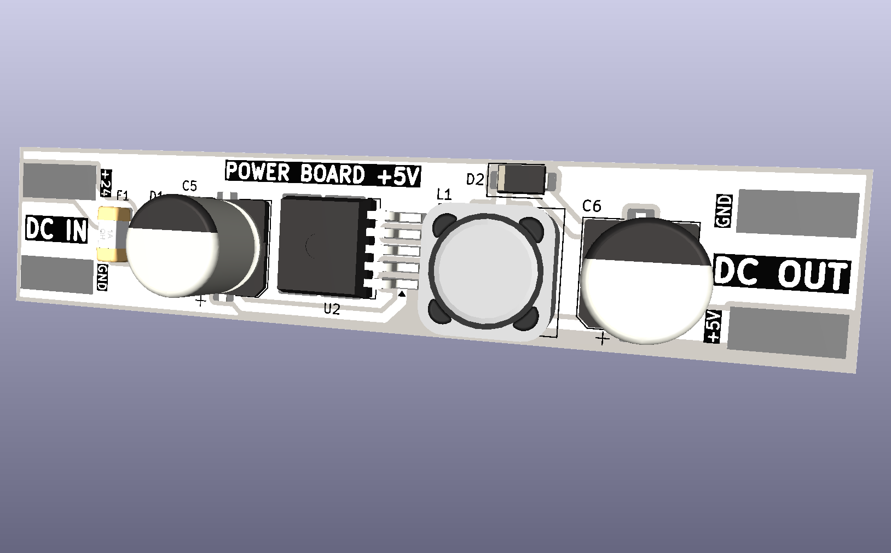
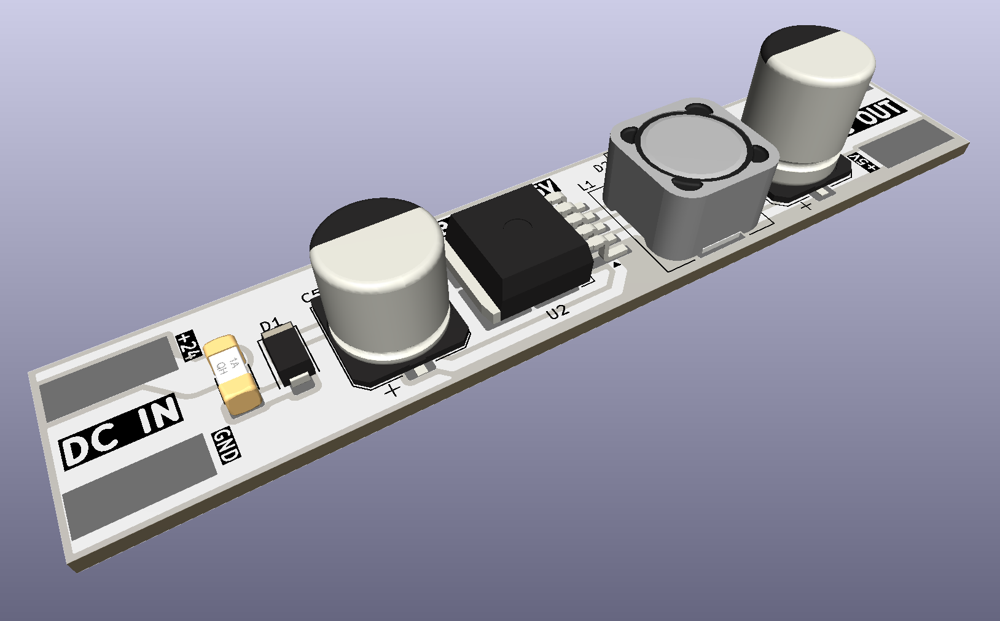

<div align="center">



# POWER BOARD +5V

**Placa de alimentação DC-DC step-down (buck converter) com entrada de 24V e saída regulada de 5V, baseada em regulador chaveado SMD de alta eficiência**

[](https://www.kicad.org/)
[](.)
[](.)
[](.)
[](.)
[](.)
[](.)
[](.)

</div>

---

## 📋 Índice

- [POWER BOARD +5V](#power-board-5v)
  - [📋 Índice](#-índice)
  - [Visão Geral](#visão-geral)
  - [Renders 3D](#renders-3d)
  - [Funcionalidades](#funcionalidades)
  - [Diagrama de Funcionamento](#diagrama-de-funcionamento)
  - [Especificações Técnicas](#especificações-técnicas)
  - [Lista de Materiais](#lista-de-materiais)
  - [Pinagem dos Conectores](#pinagem-dos-conectores)
    - [DC IN — Entrada (lado esquerdo)](#dc-in--entrada-lado-esquerdo)
    - [DC OUT — Saída (lado direito)](#dc-out--saída-lado-direito)
    - [Pontos de Teste](#pontos-de-teste)
  - [Aplicações](#aplicações)
  - [Estrutura do Repositório](#estrutura-do-repositório)
  - [Como Usar](#como-usar)
    - [Instalação básica](#instalação-básica)
    - [Dica de Integração](#dica-de-integração)
  - [⚠️ Avisos de Segurança](#️-avisos-de-segurança)
  - [Sobre](#sobre)

---

## Visão Geral

**POWER BOARD +5V** é uma placa de alimentação DC-DC do tipo **buck converter (step-down)**, projetada pela **ZAT ELECTRONIC** utilizando **KiCad 10**. A placa converte uma tensão de entrada de **+24VDC** em uma saída regulada e estável de **+5VDC / 3A**, utilizando o regulador chaveado **LM2596S-5** no encapsulamento TO-263-5 (SMD).

O design é compacto e totalmente SMD, com conexões de entrada e saída por **pads de solda** expostos diretamente na PCB. A placa inclui **fusível de proteção SMD 3A**, **diodo Schottky** de roda livre, **indutor de 33µH** e capacitores eletrolíticos de alta capacidade para filtragem e estabilidade da saída.

> ⚡ Topologia **buck converter** de alta eficiência — ideal para sistemas embarcados, painéis de controle industrial e projetos que alimentam microcontroladores e periféricos a partir de fontes de 24VDC.

---

## Renders 3D

<div align="center">


*Vista superior — regulador LM2596S-5, indutor, capacitores eletrolíticos e fusível SMD*

<br/>



*Vista isométrica — layout compacto com pads DC IN e DC OUT nas extremidades*

</div>

---

## Funcionalidades

- ✅ **Regulador chaveado LM2596S-5** (TO-263-5 SMD) — saída fixa de 5V, até 3A
- ✅ **Topologia buck converter** — alta eficiência em comparação com reguladores lineares
- ✅ **Entrada 24VDC** — compatível com fontes industriais e painéis de automação
- ✅ **Saída 5VDC / 3A** — alimentação estável para microcontroladores e periféricos
- ✅ **Fusível SMD 3A** (encapsulamento 1808/2410) — proteção contra sobrecorrente na entrada
- ✅ **Diodo Schottky SS54** (SMA SMD) — diodo de roda livre de alta velocidade
- ✅ **Indutor 33µH** (12×12mm) — núcleo de potência para o estágio de conversão
- ✅ **Capacitor de entrada 100µF/35V** (SMD eletrolítico) — filtragem da tensão de entrada
- ✅ **Capacitor de saída 680µF/16V** (SMD eletrolítico) — filtragem e estabilidade da saída
- ✅ **4 pontos de teste (TP1–TP4)** — facilidade de medição e diagnóstico em bancada
- ✅ **Pads de conexão expostos** — DC IN (+24V / GND) e DC OUT (+5V / GND)
- ✅ **Layout totalmente SMD** — compacto e adequado para integração em painéis

---

## Diagrama de Funcionamento

```
DC IN (+24V) ──[F1 3A]──[D1 SMA]──────────────────────► +24V interno
                                   │
                                  [C5 100µF/35V] (filtro entrada)
                                   │
                              [U2 LM2596S-5]  ← Regulador buck
                                   │
                                  [L1 33µH]   ← Indutor de saída
                                   │
                    [D2 SS54] ←────┤            ← Diodo Schottky (roda livre)
                    (SMA SMD)      │
                                  [C6 680µF/16V] (filtro saída)
                                   │
DC OUT (+5V) ◄─────────────────────┘

DC IN (GND) ──────────────────────────────────────────► DC OUT (GND)

TP1, TP2 → pontos de teste na entrada
TP3, TP4 → pontos de teste na saída
```

---

## Especificações Técnicas

| Parâmetro | Valor |
|-----------|-------|
| **Topologia** | Buck Converter (Step-Down) |
| **Regulador** | LM2596S-5 (TO-263-5 SMD) |
| **Tensão de Entrada** | 24VDC |
| **Tensão de Saída** | 5VDC (fixa) |
| **Corrente de Saída máx.** | 3A |
| **Potência máxima de saída** | 15W |
| **Diodo de roda livre** | SS54 — Schottky 5A / 40V (SMA SMD) |
| **Indutor** | 33µH — 12×12×8mm |
| **Capacitor de entrada** | 100µF / 35V (eletrolítico SMD) |
| **Capacitor de saída** | 680µF / 16V (eletrolítico SMD) |
| **Fusível** | 3A (SMD 1808/2410) |
| **Pontos de teste** | 4x (TP1, TP2, TP3, TP4) |
| **Conexões** | Pads de solda expostos (DC IN / DC OUT) |
| **Ferramenta de Projeto** | KiCad 10 |
| **Tipo de montagem** | SMD |

---

## Lista de Materiais

| Ref | Componente | Valor / Parte | Encapsulamento |
|-----|-----------|--------------|----------------|
| U2 | Regulador Chaveado | LM2596S-5 | TO-263-5 SMD |
| L1 | Indutor de Potência | 33µH | 12×12×8mm |
| D2 | Diodo Schottky (roda livre) | SS54 — 5A / 40V | SMA SMD |
| D1 | Diodo SMD | SS36 | SMA SMD |
| C5 | Capacitor Eletrolítico (entrada) | 100µF / 35V | SMD Eletrolítico 10×10mm |
| C6 | Capacitor Eletrolítico (saída) | 680µF / 16V | SMD Eletrolítico 10×12,5mm |
| F1 | Fusível de Proteção | 3A | SMD 1808/2410 |
| TP1–TP4 | Pontos de Teste | — | SMD |

---

## Pinagem dos Conectores

A placa utiliza **pads de solda expostos** nas extremidades para conexão da entrada e saída. Não há conectores PTH — a ligação é feita diretamente por fios soldados ou trilhas de PCB mãe.

### DC IN — Entrada (lado esquerdo)

| Pad | Sinal | Descrição |
|-----|-------|-----------|
| + | +24V | Tensão de entrada positiva |
| − | GND | Terra / Negativo |

### DC OUT — Saída (lado direito)

| Pad | Sinal | Descrição |
|-----|-------|-----------|
| + | +5V | Tensão de saída regulada |
| − | GND | Terra / Negativo |

### Pontos de Teste

| Ref | Localização | Função |
|-----|-------------|--------|
| TP1 | Entrada | Medição +24V |
| TP2 | Entrada | Medição GND entrada |
| TP3 | Saída | Medição +5V |
| TP4 | Saída | Medição GND saída |

---

## Aplicações

- 🏭 **Automação industrial** — alimentação de CLPs, sensores e módulos a partir de barramentos 24V
- 🤖 **Projetos com Arduino e ESP32** — conversão de 24V industrial para 5V de lógica
- 💡 **Painéis de iluminação LED** — alimentação de controladoras a partir de fonte 24V
- 🔌 **Sistemas embarcados** — fonte embarcada compacta em projetos de hardware customizado
- 📡 **IoT industrial** — alimentação de gateways e módulos de comunicação
- 🖥️ **Painéis de controle** — fonte auxiliar de 5V integrada ao painel principal 24V

---

## Estrutura do Repositório

```
POWER_BOARD/
├── POWER_BOARD.kicad_pro         # Arquivo de projeto KiCad
├── POWER_BOARD.kicad_sch         # Esquemático (KiCad 10)
├── POWER_BOARD.kicad_pcb         # Layout da PCB (KiCad 10)
├── POWER_BOARD.kicad_prl         # Configurações locais do projeto
├── packages3D/                   # Modelos 3D arquivados (STEP / WRL)
│   ├── L_12x12mm_H8mm.step
│   ├── 1808-2410_Fuse.STEP
│   └── ...
├── fp-info-cache                 # Cache de footprints
├── imagem_1.png                  # Render 3D superior
├── imagem_2.png                  # Render 3D isométrico
└── README.md
```

---

## Como Usar

### Instalação básica

```
Fonte 24VDC (+) ────► Pad DC IN (+24V)
Fonte 24VDC (-) ────► Pad DC IN (GND)

Carga 5VDC      ────► Pad DC OUT (+5V)
Carga GND       ────► Pad DC OUT (GND)
```

### Dica de Integração

> 🔧 Para integração em PCB mãe, solde fios diretamente nos pads DC IN e DC OUT, ou projete a placa mãe com pads compatíveis para encaixe direto. Respeite a polaridade indicada na serigrafia (+24V / GND / +5V).

---

## ⚠️ Avisos de Segurança

> 🔴 **ATENÇÃO**

- **Não inverta a polaridade** na entrada — o fusível protege contra sobrecorrente, mas a inversão pode danificar o regulador.
- Respeite a **corrente máxima de 3A** na saída para não danificar o LM2596S-5.
- O regulador e o indutor podem **aquecer durante operação** em cargas próximas ao limite — garanta ventilação adequada.
- **Verifique a tensão de entrada** antes de conectar — tensões acima de 40V danificam o regulador.
- Utilize o **fusível SMD 3A** correto — nunca o substitua por um de valor superior sem analisar o circuito.

---

## Sobre

<div align="center">

Projetado por **ZAT ELECTRONIC**

*POWER BOARD +5V — Made in Brazil 🇧🇷*

[](https://www.kicad.org/)
[](https://www.oshwa.org/)

</div>